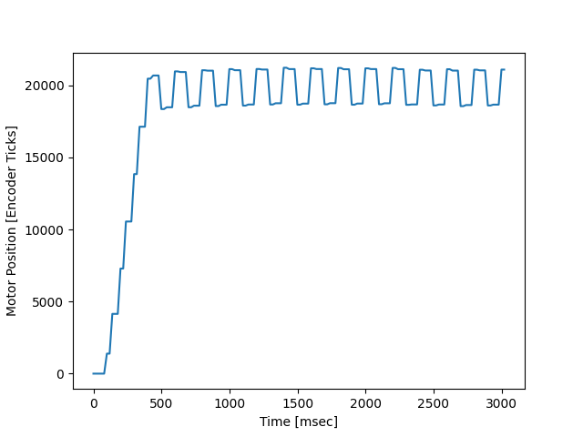
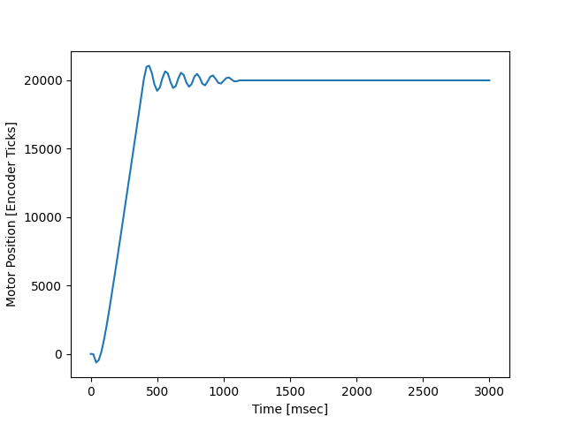
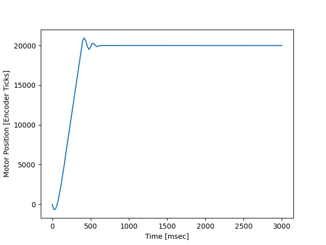

# ME405-Lab3
In this lab experiment we used our existing MotorDriver, EncoderReader, and CLPController classes to drive two seperate motors at the same time using a priority based task scheduling regime. Each motor has its own task in the file, main.py, and the setpoints for each motor are provided to their respective taskes via shares sent in the main section of main.py.

We generated three plots, shown below, to demonstrate the functionality of our motor system.

## Plot One -- Kp = 0.2, Task Period = 50 ms

At a task period of 50 ms, the task was running far to slowly for the motor to converge to the setpoint of 20,000 encoder ticks. As the plot shows, the motor perpetually oscillates about the setpoint but never fully reaches it. 

## Plot Two -- Kp = 0.2, Task Period = 20 ms

At a 20 ms task period the motor is able to converge at the desired setpoint, but it still has a lot of oscillation, which causes the motor to take longer than necessary to reach the setpoint.

## Plot Three -- Kp = 0.2, Task Period = 10 ms

This plot shows our ideal motor task period, 10 ms. At this period, the motor has little oscillation about the setpoint and reaches the setpoint very quickly.

## Conclusion
We found ideal motor performance at a task period of 10 ms. The faster the period, the better the motor performance performance. We recommend 10 ms because it is roughly the largest task period at which motor performance remains ideal.

